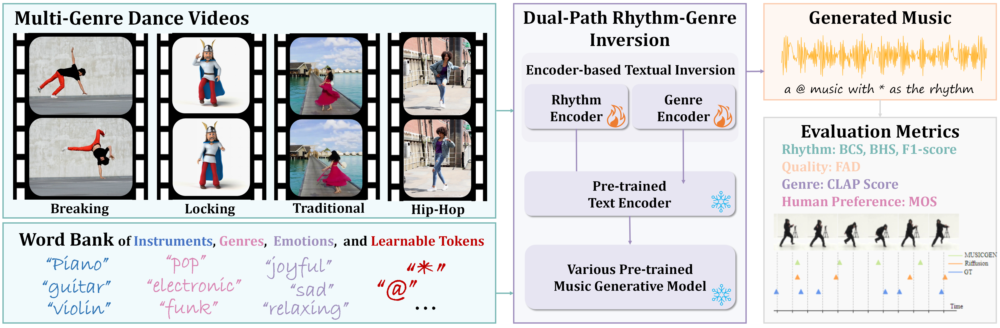

# Dance-to-music_Siggraph_Aisa_2024
The official code for [“Dance-to-Music Generation with Encoder-based Textual Inversion“](https://arxiv.org/abs/2401.17800)

Demo is available at [Dance-to-music](https://youtu.be/y2pG2S5xDLY).

More results and comparisons with other methods are available at [Dance-to-music](https://lsfhuihuiff.github.io/dance2music.github.io/). 
## Installation
It requires Python 3.9, PyTorch 2.0.0. You can run the following:

```shell
# Best to make sure you have torch installed first, in particular before installing xformers.
# Don't run this if you already have PyTorch installed.
pip install 'torch>=2.0'
pip install -e .  # or if you cloned the repo locally (mandatory if you want to train).
```

We also recommend having `ffmpeg` installed, either through your system or Anaconda:
```bash
sudo apt-get install ffmpeg
# Or if you are using Anaconda or Miniconda
conda install "ffmpeg<5" -c conda-forge
```

## Models
We use the pre-trained facebook/musicgen-small model of MusicGen.
* [MusicGen](./docs/MUSICGEN.md): A state-of-the-art controllable text-to-music model.

The trained encoder model for MUSICGEN is available at [embedding_models](https://drive.google.com/file/d/1MdIw2syjppTfsFrqM4_0tkf0mDylbH33/view?usp=sharing)

The trained encoder model for Riffusion is available at [embedding_Riffusion](https://drive.google.com/file/d/1d0E5DeDcWxP6DtPAu4rL7JiLoVcnKdrs/view?usp=sharing).


## Prepare Dataset
AIST++ dataset are available at [AIST++](https://google.github.io/aistplusplus_dataset/download.html)
We provide the video links of our InDv dataset at [IndV](https://drive.google.com/file/d/1d0E5DeDcWxP6DtPAu4rL7JiLoVcnKdrs/view?usp=sharing)

We segment the video data into 5.12-second clips. For the AIST++ dataset, we use the officially provided 2D keypoints and divide them into feature sequences of length 305. For the InDV dataset, we extract 2D keypoints using [mmpose](https://github.com/open-mmlab/mmpose) on the segmented videos, resulting in sequences of length 308.

Get metadata for each audio.
```bash
python info.py
```
Get one-hot genre encoding
```bash
python genre.py
```
Put all data under the same folder.
## Train the model

```bash
dora run solver=musicgen/musicgen_base_32khz model/lm/model_scale=medium continue_from=/path/to/pretrained/model conditioner=text2music
```
More details about training, please refer to
the [training documentation](./docs/TRAINING.md).

## Inference
```bash
python test.py
```
## License
* The code in this repository is released under the MIT license as found in the [LICENSE file](LICENSE).
* The models weights in this repository are released under the CC-BY-NC 4.0 license as found in the [LICENSE_weights file](LICENSE_weights).

## Cite this work

If you found this tool useful, please consider citing
```bibtex
@article{li2024dance,
  title={Dance-to-music generation with encoder-based textual inversion of diffusion models},
  author={Li, Sifei and Dong, Weiming and Zhang, Yuxin and Tang, Fan and Ma, Chongyang and Deussen, Oliver and Lee, Tong-Yee and Xu, Changsheng},
  journal={arXiv preprint arXiv:2401.17800},
  year={2024}
}
```

## Reference
We would like to thank the authors of these repos for their contribution.

[https://github.com/facebookresearch/audiocraft](https://github.com/facebookresearch/audiocraft)

[https://github.com/riffusion/riffusion-hobby](https://github.com/riffusion/riffusion-hobby)

[https://github.com/haoheliu/AudioLDM](https://github.com/haoheliu/AudioLDM)

[https://github.com/open-mmlab/mmpose](https://github.com/open-mmlab/mmpose)


